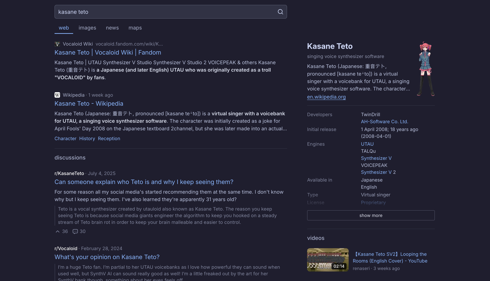

<p align="center">
  
  <br>

  <p align="center">
    search the web without AI slop. pretty, fast,<br> privacy-friendly metasearch engine.
    <br>
    <strong><a href="#installation">start searching! »</a></strong>
  </p>
</p>

<br>



<br>

[search.tiago.zip](https://search.tiago.zip) is very pretty and fast metasearch engine running on cf workers, sourcing answers from brave search and kagi :3

### privacy-first

no third-party tracking is used by default, and you can search without cookies or accounts. i do not log any type of data and your searches are never stored or analyzed.

### bangs, rich answers, snippets

similar to duckduckgo, you can use !bangs to search other sites directly, and this also supports instant answers for calculations, weather, crypto prices, and more, along with previews for lyrics and youtube videos.

### fast and better ux

metasearch works with keyboard shortcuts and the image tab supports a built-in ai slop remover.

### json api

you can query the engine over a simple unauthenticated endpoint:

```bash
curl -X POST https://search.tiago.zip/api \
  -H "Content-Type: application/json" \
  -d '{"query":"metasearch","type":"web","page":0}'
```

[more about the api](https://search.tiago.zip/api)

## self-hosting

metasearch runs on cloudflare workers with static assets. to self-host:

```bash
# clone and install
git clone https://github.com/tiagozip/metasearch.git
cd metasearch
bun install

# set your jwt secret (used to sign search tokens)
wrangler secret put JWT_SECRET

# deploy to cloudflare workers
bun run deploy
```

### updating bangs

bangs are embedded in the bundle for zero-latency lookups. to refresh them:

```bash
bun run bangs
bun run deploy
```

### local development

```bash
# create a .env file with a dev secret
echo 'JWT_SECRET=dev-secret' > .env

# start local dev server
bun run dev
```

### other instances

* [tiago.ferencmeszaros.hu](https://tiago.ferencmeszaros.hu?ref=metasearch-readme)
* [search.dieofdeath.gay](https://search.dieofdeath.gay?ref=metasearch-readme)
* [s.jim88.de](https://s.jim88.de/?ref=metasearch-readme)
* [search.pera.lol](https://search.pera.lol?ref=metasearch-readme)
* [search.itsdefnotleon.qzz.io](https://search.itsdefnotleon.qzz.io?ref=metasearch-readme)
* [searchengine.killingpeopleis.fun](https://searchengine.killingpeopleis.fun?ref=metasearch-readme)

if you're self-hosting metasearch yourself, please feel free to open a pr to add your instance here!

please note that most of these instances will lack kagi search support.

### license

see [LICENSE](./LICENSE) for more details.
